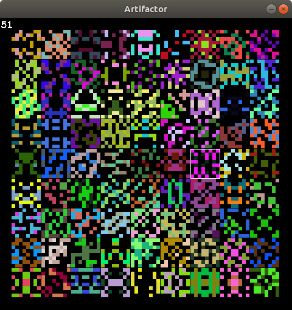

# Artifactor

An "artifact" generator. Artifacts are randomly-generated, symmetric, two-color images. Due to their randomly-generated nature, most of them aren't that interesting, but occasionally you can discover some good ones. Here is an example of the generator in action:

 

Idea taken from the game Tea Garden by Younès Rabii (<a href="https://github.com/Pyrofoux">"Pyrofoux"</a>), where such artifacts are flowers that the player can find. This implementation is not a game, only a generator (with optional simple renderer using SDL2). You can browse artifacts, find the same ones again using their unique IDs, and save them as images.

Generator GUI controls:

* arrow keys or WASD to navigate selection cursor to browse
* X to save selected artifact to image
* number keys (0-9) to input specific ID to jump to,
* Enter to enter and jump to this ID

The possible artifact IDs range from 0 to 4294967295.
